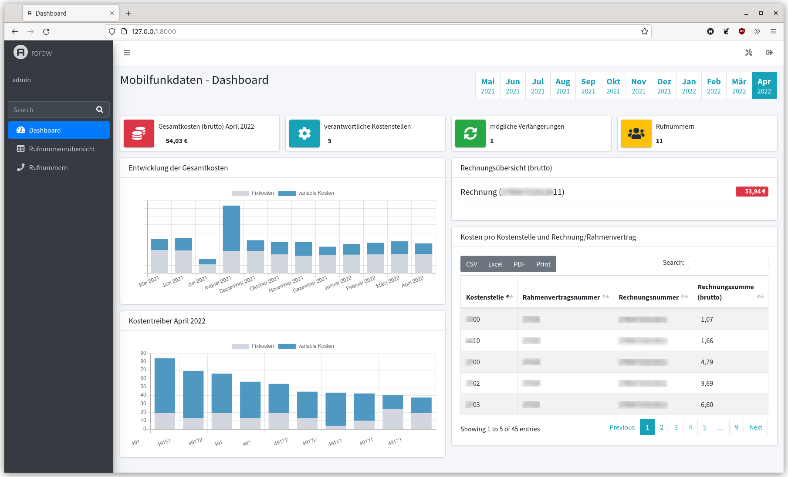

# rorow
rorow is a Django web application (with [AdminLTE](https://github.com/ColorlibHQ/AdminLTE/) and [pandas](https://github.com/pandas-dev/pandas)) to process mobile phone bills of a large german telecommunication provider and present them in an understandable way.

## Installation
```
git clone https://github.com/derhelge/rorow
cd rorow
cp env.example .env
```
Adjust the values in the env file.
```
python3 -mvenv venv
source venv/bin/activate
pip install --upgrade pip
pip install wheel
pip install -r requirements.txt
cd rorow

python manage.py makemigrations
python manage.py migrate

echo "from django.contrib.auth import get_user_model; User = get_user_model(); User.objects.create_superuser('admin', 'admin@example.com', 'admin')" | python manage.py shell

python manage.py runserver

```
Set `DEBUG = False` in `.env` when everything works as excepted.

## Usage
After installation, log in as admin / admin and add files in in the Django admin interface http://127.0.0.1:8000/admin/. Note that the frontend is not available without any uploaded files. Only DTAG invoices, credit notes and master reports can be processed.

 .